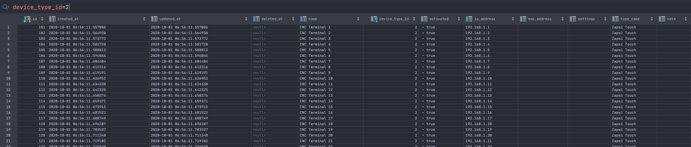
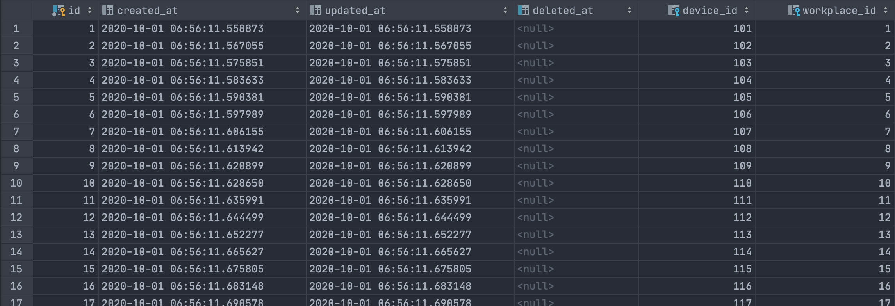
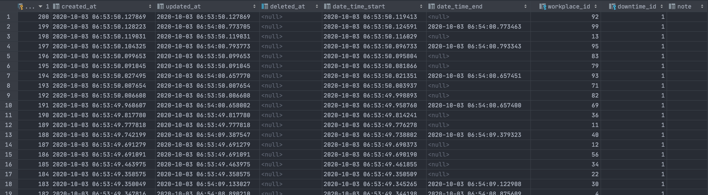
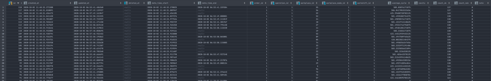

[](https://www.jetbrains.com/go/)
<br/>

[](https://github.com/petrjahoda/terminal_service/commits/master)
[](https://github.com/petrjahoda/terminal_service/issues)
<br/>


<br/>
[](https://hub.docker.com/r/petrjahoda/terminal_service)
[](https://hub.docker.com/r/petrjahoda/terminal_service/tags)
<br/>
[](https://www.postgresql.org) [](https://www.docker.com)

# Terminal Service
## Description
Go service, that creates and updates orders and downtimes for workplaces.

## Installation Information
Install under docker runtime using [this dockerfile image](https://github.com/petrjahoda/system/tree/master/latest) with this command: ```docker-compose up -d```

## Implementation Information
Check the software running with this command: ```docker stats```. <br/>
Terminal_service has to be running.

## Additional information
* working with workplace that has linked devices in  ```device_workplace``` table, device has to of type 'Zapsi Touch' in ```device``` table
* creates and updates orders in ```order_records``` table
* creates and updates downtimes in ```downtime_records``` table


Devices example


Device Workplaces example


Downtime Records example


Order Records example



© 2020 Petr Jahoda

